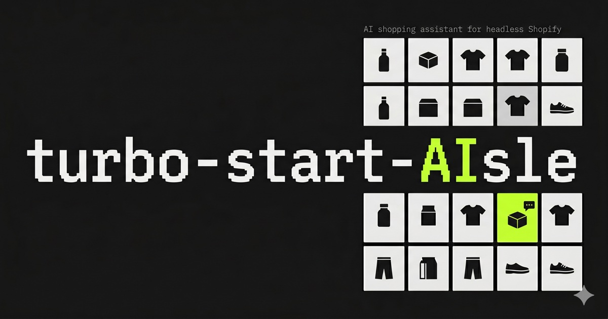

# Turbo Start Aisle



> **Aisle** — a starter for headless Shopify with an AI shopping assistant baked in. Built on top of `turbo-start-shopify`, with a floating chat widget, page-context capture, AI-controlled filters, and inline product cards powered by Vercel AI SDK + Gemini 2.5 Flash + Sanity Agent Context MCP.

The "AI" lives inside the word — and inside the chat bubble.

## What's added on top of turbo-start-shopify

- `packages/ai-commerce/` — chat widget UI, AI tool definitions, page-context React Query hooks, system prompt, Sanity Agent Context MCP wrapper.
- `apps/web/src/app/api/chat/route.ts` — Vercel AI SDK route handler (Gemini 2.5 Flash + MCP tools + client tools).
- `apps/web/src/components/page-context-tracker.tsx` — keeps the chat aware of the current route.
- `apps/web/src/components/ai-cart-bridge.tsx` — bridges chat product cards' "Add to cart" event into the Shopify-backed cart context.
- New env entries (`GOOGLE_GENERATIVE_AI_API_KEY`, `SANITY_CONTEXT_MCP_URL`) — both optional; the chat route returns 503 until both are set.

## Setup

### 1. Configure environment

Copy `apps/web/.env.local.example` → `apps/web/.env.local` and fill in values. **Use `.env.local` only** — Next.js's `.env.local` overrides `.env`, so creating both leads to silent overrides during debugging.

You'll also need `apps/studio/.env` for the Sanity Studio. Both files are gitignored.

> **Note:** `pnpm build` resolves Sanity content (redirects, navigation) at compile time. Stub credentials pass env-schema validation but the build fails with `Dataset not found`. Use real Sanity creds, or run `pnpm dev` for development.

### 2. Sync Shopify products into Sanity

Install the [Sanity Connect for Shopify](https://apps.shopify.com/sanity-connect) app on your Shopify dev store. Point it at your Sanity project + dataset (matching `NEXT_PUBLIC_SANITY_PROJECT_ID` / `NEXT_PUBLIC_SANITY_DATASET`) and trigger an initial sync.

### 3. Deploy the Studio + Agent Context document

The AI assistant needs both a deployed Studio (Studio v5.1.0+) and a published Agent Context document. The MCP endpoint won't respond until both exist.

```bash
# Deploy schema and Studio (Studio hostname will be prompted on first run)
pnpm --filter studio schema:deploy
pnpm --filter studio deploy
```

Then in your deployed Studio (`https://<your-hostname>.sanity.studio`):

1. Click **Agent Context** in the left sidebar → **+ Create new**
2. Fill in name + slug (e.g., `shop-assistant`) + an instructions string
3. **Publish**
4. Copy the **MCP URL** at the top of the published document. Format:

   ```
   https://api.sanity.io/v2026-04-30/agent-context/<projectId>/<dataset>/<slug>
   ```

### 4. Gemini API key

Create one at https://aistudio.google.com/app/apikey. Free tier is **5 requests/minute** on `gemini-2.5-flash`, which is enough to demo but tight — enable billing on the linked Google Cloud project for Tier 1 (1,000 RPM, ~$0.075/M input tokens; demo usage costs cents).

After enabling billing you can also bump `stopWhen: stepCountIs(5)` back to `stepCountIs(20)` in `apps/web/src/app/api/chat/route.ts` for richer multi-step tool use.

### 5. Final env entries

```bash
# In apps/web/.env.local
SANITY_CONTEXT_MCP_URL=https://api.sanity.io/v2026-04-30/agent-context/<projectId>/<dataset>/<slug>
GOOGLE_GENERATIVE_AI_API_KEY=<from Google AI Studio>
```

### 6. Boot

```bash
pnpm dev
```

Open http://localhost:3000. Click the bottom-right chat bubble. Ask *"show me products under $50"* or *"what brands do you have?"*.

## Troubleshooting

### `sanity schema deploy` fails with "missing required grant"

You're logged into the wrong Sanity account. Run:

```bash
pnpm --filter studio exec sanity logout
pnpm --filter studio exec sanity login
```

Pick the auth provider you used to create the org. Verify with `pnpm --filter studio exec sanity projects list` — your project should appear in the list.

### `sanity schema deploy` keeps reading the wrong project ID

A stale `apps/studio/dist/static/create-manifest.json` is overriding the env. Run `pnpm --filter studio clean` and try again — that's also baked into the `predeploy` and `schema:deploy` scripts now.

### Storefront image requests return 500 with `ENOTFOUND cdn.shopify.com`

Some VPNs (split-tunnel configurations especially) block or intercept Shopify's CDN. If `nslookup cdn.shopify.com` succeeds but `curl https://cdn.shopify.com/` returns HTTP 000, disable the VPN or whitelist `*.shopify.com` and `*.myshopify.com`.

### `/api/chat` returns 500 with "Only datasets with deployed Studio applications are supported"

You skipped step 3 above. Run `pnpm --filter studio deploy` to register a Studio for your dataset.

### Chat 500s with `RESOURCE_EXHAUSTED` from Gemini

You're on the free tier (5 requests/minute). Wait 60 seconds, or enable billing on the Google Cloud project linked to your Gemini key (see step 4).

## Reference checkouts

`.research/turbo-start-shopify/` and `.research/context-agent-sanity-test/` are read-only reference clones of the source projects. Both are gitignored. They are useful when modifying `packages/ai-commerce/` to compare against the original implementations.

---

## Foundation

Turbo Start Aisle is built on top of [`robotostudio/turbo-start-shopify`](https://github.com/robotostudio/turbo-start-shopify) — see that repository for the underlying commerce stack documentation (page builder, blog, navigation, SEO, Shopify cart, Sanity Studio, deployment, etc.). The Aisle additions are limited to `packages/ai-commerce/` and the chat-related files in `apps/web/`.

The reference checkout at `.research/turbo-start-shopify/` is the exact upstream snapshot used during this build.
